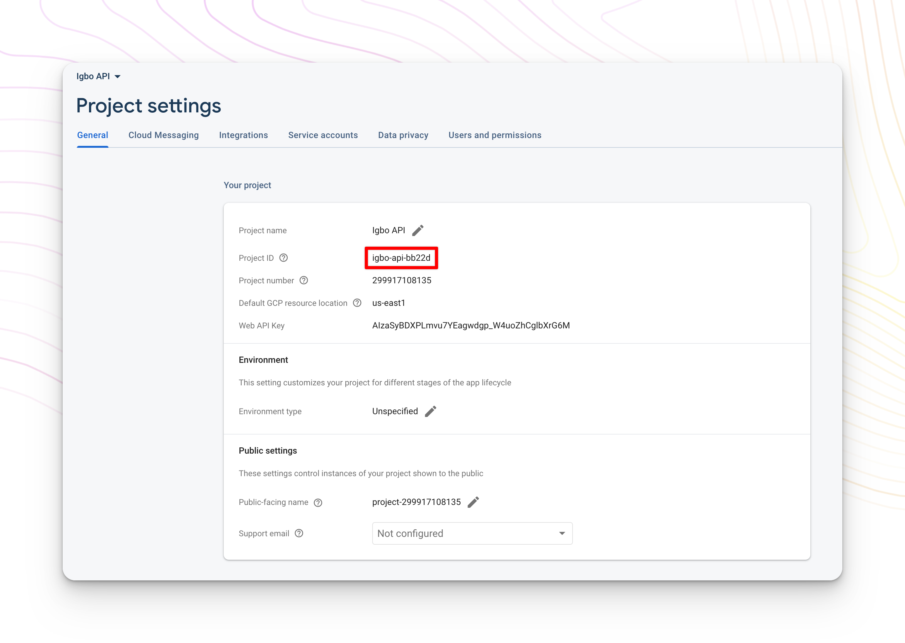
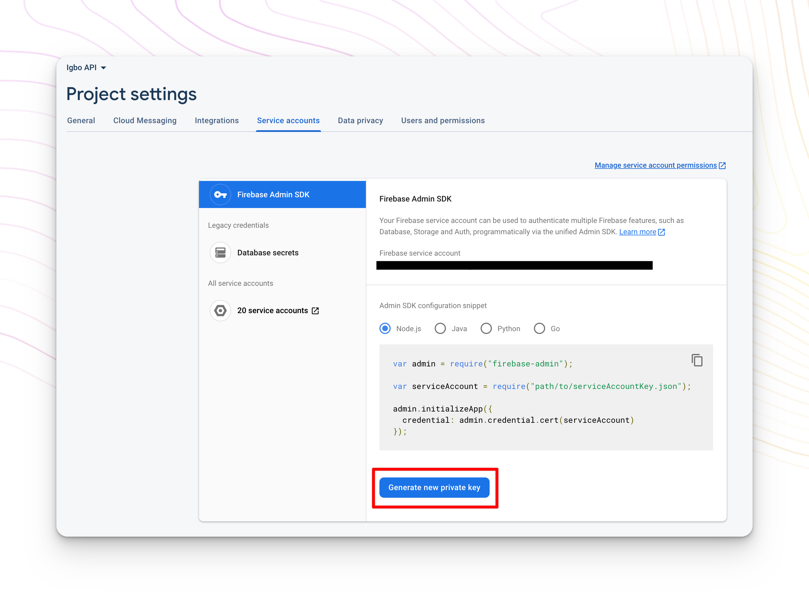
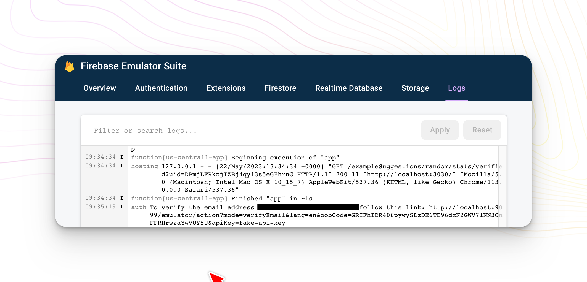

# Igbo API Editor Platform

The Igbo API Editor Platform is the admin platform used by our Igbo lexicographers to directly input word and example data into the [Igbo API](https://igboapi.com)


The platform is deployed at [https://editor.igboapi.com](https://editor.igboapi.com/)

### Contributing

Contributions are always welcome. Please first join the Nkọwa okwu volunteer community before jumping in: [join here](https://nkowaokwu.com/volunteer)

## Get Started

This is an open-source project that requires that you create your own Firebase account.

### Prerequisites

To run this project locally, the following tools need to be installed:

- [Node.js](https://nodejs.org/en/download/)
- [Yarn](https://classic.yarnpkg.com/en/docs/install)
- [MongoDB](https://docs.mongodb.com/manual/administration/install-community/)
- [Firebase](https://console.firebase.google.com/)

### Step 1: Set up the Igbo API Editor Platform

Clone the repo:

```bash
git clone https://github.com/ijemmao/igbo-api-admin.git
```

If you don't have Firebase globally install, run the following command:

```bash
npm install -g firebase-tools
```

Install the project's dependencies:

```bash
cd ../
yarn install
```

Then log into your Firebase account by running:

```bash
npx firebase login
```

### Step 2: Create Firebase Project

This project, in production, uses a production and staging Firebase projects to enable authentication, functions, and firestore.

For local development, you will need to create your **own single** Firebase project to be able to make changes.

Navigate to [Firebase](https://console.firebase.google.com) and create a new Firebase project.

Once you've created your two new projects, copy your new Firebase Project ID that can be found at **Project Settings > General > Project ID**:


Go to your [`.firebaserc`]('./.firebaserc) file in the root directory of the project,
and replace the `igbo-api-admin` and `igbo-api-admin-staging` with your Project ID:

```json
{
  "projects": {
    "default": "<project_id>",
    "staging": "<project_id>"
  }
}
```

**Note**: The `.firebaserc` is not checked into git as these changes are only meant to be local to make it easier for you to develop locally.

### Step 3: Copy your Service Account Files

Now that you have your project aliased in `.firebaserc`, we want the project to start using those projects.

Download the service account for your Firebase project by going to **Project Settings > Service accounts > Generate new private key**



Save the service account that you downloaded from Firebase as `prod-firebase-service-account.json` and `staging-firebase-service-account.json` in the top-level `/functions`.

Once you save those files in `/functions`, you're own Igbo API Editor Platform is ready to go!

### Step 4: Start the Backend API

The backend server responsible for data business logic relies on the Igbo API to be running locally.

In a separate terminal, run the following:

```
yarn start:database
```

### Step 5: Start the Platform's Dev Server

With API running, in another tab, start the dev project with:

```bash
yarn dev
```

You should now be able to access the editor platform at [http://localhost:3030](http://localhost:3030) 🎉

**Note**: This will spin up a local version of the Firebase project `igbo-api-admin-staging` which
is used for development purposes. Only Firebase Functions are getting emulated, so that means
that any users that create accounts and log in are stored in the project real Authentication.

### Common Error

If you encounter this error - `Error: Cannot find module '/root-path/igbo-api-admin/functions/index.js'. Please verify that the package.json has a valid "main" entry` - build the project by running:

```bash
yarn build:dev
```

Then go back to step 5 above.

### Step 6: Account Login

You can create an account with an email that includes the term `admin` to create a new admin account.

You will be asked to verify your email to be granted access.

Navigate to [localhost:4000](http://localhost:4000) and then go to the Logs tab to see the Functions logs.

There you will see a link to verify the email within the auth emulator. Click on that link and your account will be granted access.



### Step 7: (Optional) Seeding the Database

You will need local word suggestion and example suggestion data to see how the Igbo API Editor Platform works.

Setup a local working version of the [Igbo API](https://github.com/nkowaokwu/igbo_api#seeding-) and follow the `Seeding 🌱` step.

## Build Production

If you would like to create a production build of the project, follow these steps.

Build the Firebase production project:

```bash
yarn build
```

Start the project:

```bash
yarn start
```

In another tab, start up a local instance of the Igbo API with:

```bash
cd igbo_api
yarn dev
```

**Note** This will spin up a local, production-style version of your Firebase project
which can be used for production. It's not recommended to develop in this environment, but it
is helpful to use for local testing purposes.

You should now be able to access the editor platform at [http://localhost:3030](http://localhost:3030)

## Jest Testing

This project uses [Jest](https://jestjs.io) for unit frontend and backend tests.

To run both the frontend and backend tests, run:

```bash
yarn jest
```

To run just the frontend Jest tests, run:

```bash
yarn jest:frontend
```

To run jest the backend Jest tests, first start the connection to the database:

```bash
yarn start:database
```

Then run the backend Jest tests:

```bash
yarn jest:backend
```
